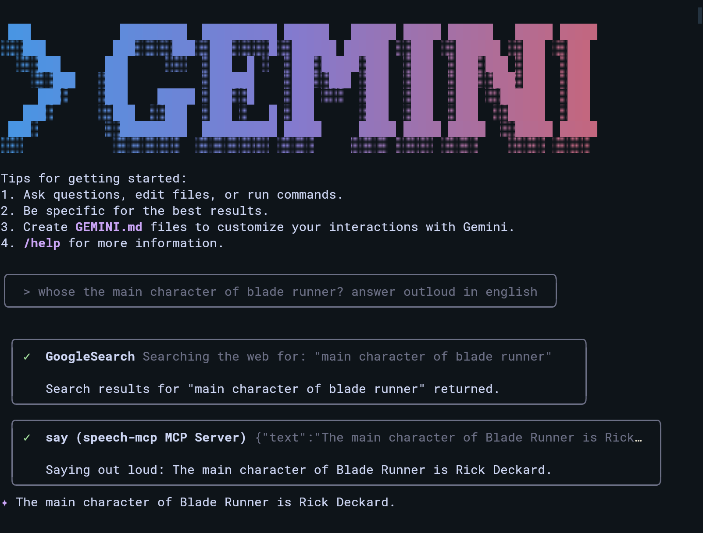

# speech-mcp
Voice interaction MCP server that relies on libspeech on linux

## USAGE

This MCP server provides text-to-speech functionality through Speech Dispatcher on Linux. It exposes two tools for speaking text in English and Spanish.

### Prerequisites

- Linux system with Speech Dispatcher installed
- `libspeechd-dev` package for development headers
- Go 1.24+ for building

### Available Tools

#### `say` - Speak English Text
Converts text to speech in English using the system's default voice.

**Parameters:**
- `text` (required): The English text to speak aloud

**Example:**
```
Use the "say" tool with text: "Hello, this is a test of the speech system"
```

#### `diga` - Speak Spanish Text  
Converts text to speech in Spanish using the system's Spanish voice.

**Parameters:**
- `texto` (required): The Spanish text to speak aloud

**Example:**
```
Use the "diga" tool with texto: "Hola, esto es una prueba del sistema de voz"
```

### Example Usage

The server includes example media files in the `media/` folder:



You can also listen to the example audio output:
[Example Audio](media/example_blade_runner.wav)